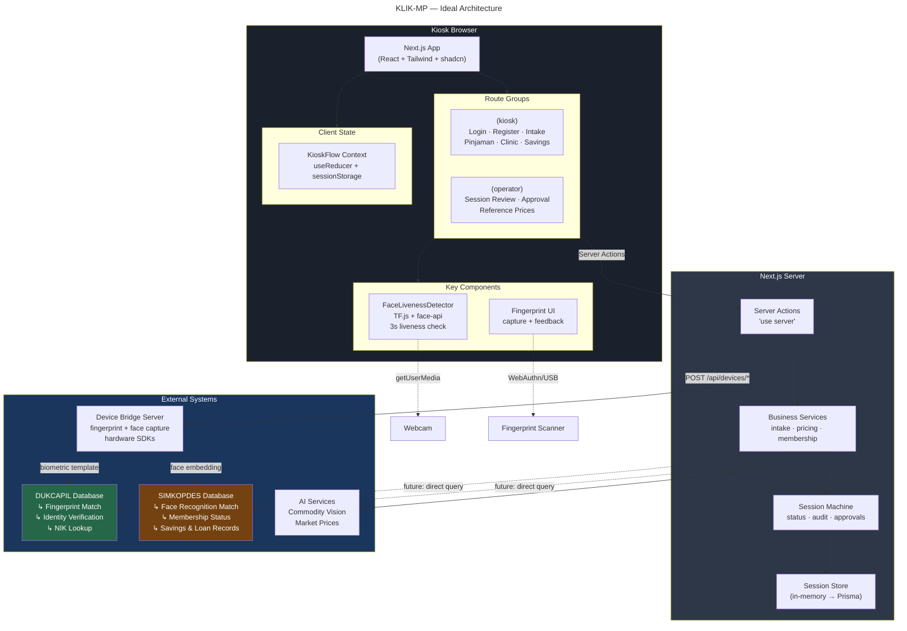
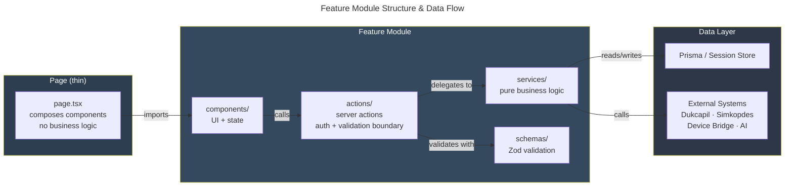
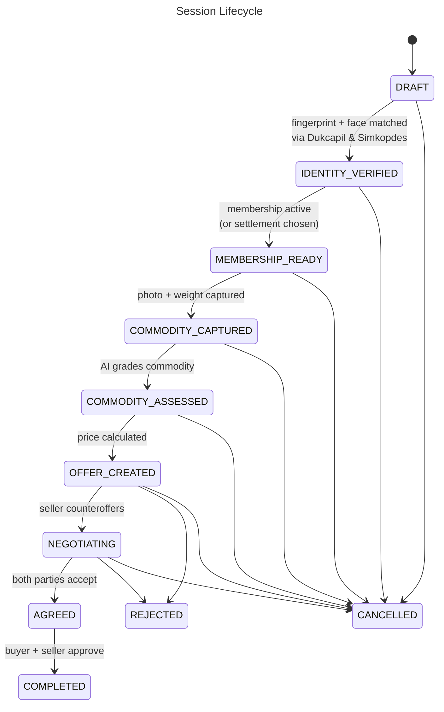

```mermaid
---
title: Biometric Data Flow — Fingerprint & Face Matching
---
sequenceDiagram
  participant User as User
  participant Kiosk as Kiosk Browser
  participant Bridge as Device Bridge Server
  participant FPSDK as Fingerprint SDK
  participant FaceSDK as Face SDK
  participant Dukcapil as DUKCAPIL Database
  participant Simkopdes as SIMKOPDES Database
  participant App as KLIK-MP Server

  rect rgb(30, 41, 59)
    Note over User,App: FINGERPRINT FLOW
    User->>Kiosk: Tempel jari
    Kiosk->>FPSDK: capture fingerprint
    FPSDK-->>Kiosk: fingerprint template
    Kiosk->>Bridge: POST /api/devices/fingerprint
    Bridge->>FPSDK: verify quality
    FPSDK-->>Bridge: template OK
    Bridge->>Dukcapil: match fingerprint
    Dukcapil-->>Bridge: matched NIK + identity data
    Bridge-->>Kiosk: { verified: true, nik, nama }
    Kiosk->>App: Server Action: login/register
    App-->>Kiosk: session token
  end

  rect rgb(30, 41, 59)
    Note over User,App: FACE FLOW
    User->>Kiosk: Arahkan wajah ke kamera
    Kiosk->>Kiosk: TF.js face detection (3s liveness)
    Kiosk->>Kiosk: capture face image
    Kiosk->>Bridge: POST /api/devices/face-recognition
    Bridge->>FaceSDK: extract face embedding
    FaceSDK-->>Bridge: embedding vector
    Bridge->>Simkopdes: match face
    Simkopdes-->>Bridge: matched member ID + status
    Bridge-->>Kiosk: { verified: true, memberId, status }
    Kiosk->>App: Server Action: login/register/intake
  end
```

## Architecture Summary

| Layer | Technology | Role |
|-------|-----------|------|
| **Client** | Next.js 16 + React 19 + Tailwind 4 | Kiosk & Operator UIs |
| **Face Auth** | TensorFlow.js + `@vladmandic/face-api` | Client-side liveness detection (3s hold) |
| **Server** | Next.js App Router + Server Actions | Business logic, validation, orchestration |
| **Hardware** | Device Bridge Server | Mediates fingerprint/face scanners |
| **Fingerprint DB** | **DUKCAPIL** | National ID fingerprint matching |
| **Face DB** | **SIMKOPDES** | Cooperative member face matching |
| **Session** | In-memory → Prisma/PostgreSQL | Status machine with audit trail |

### Key Principles

- **Fingerprint** captured via hardware scanner → matched against DUKCAPIL national database
- **Face** captured via browser webcam + TF.js liveness check → embedded → matched against SIMKOPDES member database
- **No plaintext biometric data** stored in KLIK-MP — only opaque references from external systems
- **Service layer** is pure business logic, testable without I/O
- **Server Actions** are the only boundary between client and server
- **Zod** validates every input before it reaches business logic
